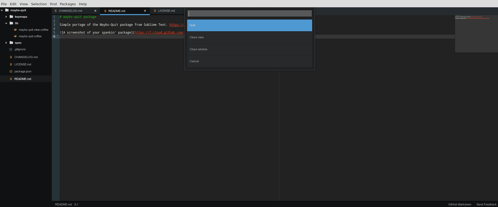

# maybs-quit package

Simple portage of the [Maybs-Quit package from Sublime Text](https://github.com/xavi-/sublime-maybs-quit).

Quote :
> Why are <kbd>ctrl/cmd</kbd> + <kbd>w</kbd> (close file) and <kbd>ctrl/cmd</kbd> + <kbd>q</kbd> (quit) right next to each other?!?! I'm just trying to close a file, but for some insane reason my pinky drifts 1cm to the left and suddenly sublime disappears.
>
> Never again!



## Installation
```sh
apm install maybs-quit
```
or find it in the Packages tab under settings.

## Usage
The default <kbd>ctrl/cmd</kbd> + <kbd>q</kbd> keybinding is replaced by the menu from Maybs-Quit.

<kbd>alt</kbd> + <kbd>F4</kbd> still quits the application.
